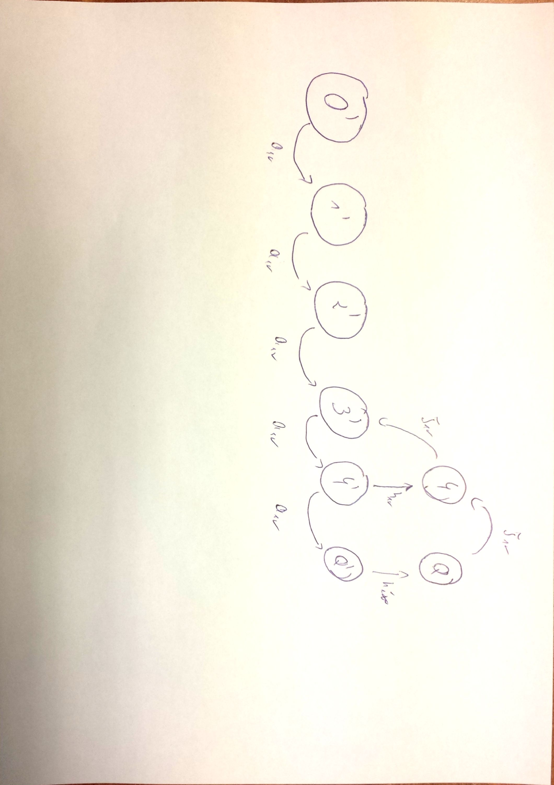

#Kolokwium 2015 ( pierwszy termin )

#Zadanie 2

w systemie M/M/1 parametry strumienia zgłoszeń wynoszą $$ a_{sr} $$ i $$ b_{sr} $$ zaś wydajność procesora wynosi $$ v $$ 
Narysuj graf przejść stanów procesu urodzin i śmierci dla następującego modelu z wakacjami. Każdorazowo po zakończeniu obsługi zgłoszenia lub kolejnych wakacji 
procesor sprawdza liczbę zgłoszeń w systemie i jeżeli nie przekracza ona 3, udaje się na wakacje, w trakcie których nie obsługuje zgłoszeń; 
w przeciwnym razie obsługuje kolejne zgłoszenie. Czas trwania wakacji ma rozkład wykładniczy ze średnią $$ h_{sr} $$

