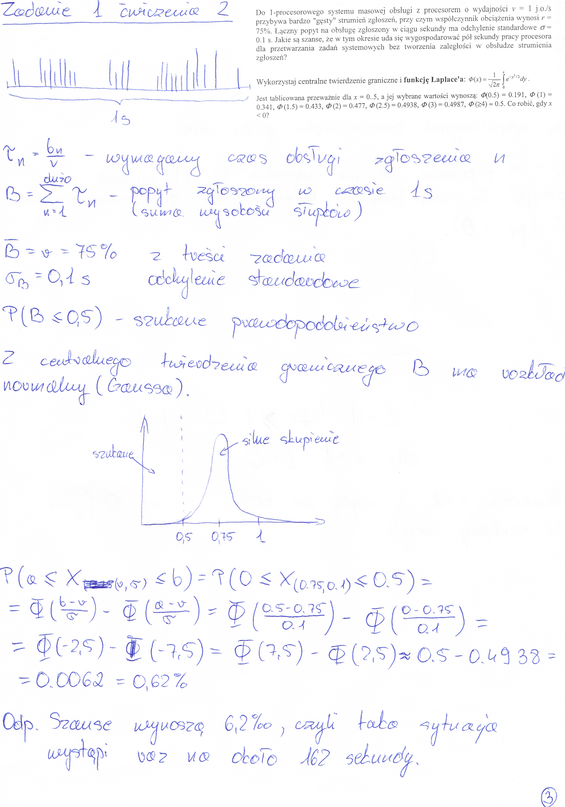

#ZADANIE 2-01

Do 1-procesorowego systemu masowej obsługi z procesorem o wydajności $$ v = 1 \frac{j.o}{s} $$ przybywa bardzo "gęsty" strumień zgłoszeń
przy czym współczynnik obciążenia wynosi $$ r = 75\% $$.
Łączny popyt na obsługę zgłoszony w ciągu sekundy ma odchylenie standardowe σ = 0.1 s.

Jakie są szanse, że w tym okresie uda się wygospodarować pół sekundy pracy procesora dla przetwarzania zadań systemowych bez tworzenia zaległości w obsłudze strumienia zgłoszeń?

### Wskazówki

> Wykorzystaj centralne twierdzenie graniczne

> Wykorzystaj funkcję Laplace'a

## Rozwiązanie

 

