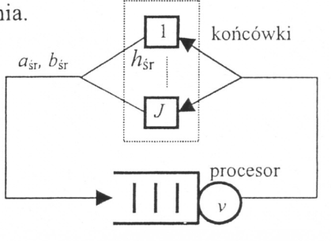

#ZADANIE 4-01

#### cechy zadania: zadanie z prawem little'a

1 procesorowy system masowej obsługi współpracuje z $$ J = 10 $$ inteligentnymi końcówkami w trybie konwersacyjnym zapytanie odpowiedź.
 
Po otrzymaniu odpowiedzi końcówka generuje nowe zapytanie po czasie namysłu wynoszącym śrenio $$ h_{sr} = 4s $$.

Średnia liczba operacji niezbędnych do wygenerowania odpowiedzi wynosi $$ b_{sr} = 15000 $$, zaś procesor w systemie posiada wydajność $$ v = 5000 \frac{operacji}{s} $$

Wyznacz zależność pomiędzy współczynnikiem bezczynności procesora $$ ( p_o ) $$. a średnim opóźnieniem buforowania $$ ( \omega ) $$.

  

### Dane:

> $$ h_{sr} = 4s $$ czas namysłu
 
> $$ b_{sr} = 15000 operacji  $$ średnia wielkość zgłoszenia
 
> $$ v = 5000 \frac{operacji}{s} $$ prędkość procesora 

> $$ J = 10 $$ koncowek

> prawo littlea: $$ \overline{populacja} = \overline{cyrkulacja} * \overline{czas.zycia} $$

> $$ \overline{populacja} = J = 10$$  

> $$ \overline{cyrkulacja} = h_{sr} + \frac{b_{sr}}{v} + \omega  $$ ( sredni czas przybywania )
 
> $$ \overline{czas.zycia} = \frac{1}{a_{sr}} = \frac{1-p_0}{\tau_{sr}} = \frac{1-p_0}{\frac{b_{sr}}{v}} $$ 

## Rozwiązanie

$$ \overline{populacja} = \overline{cyrkulacja} * \overline{czas.zycia} $$

$$ J =  (\frac{1-p_0}{\frac{b_{sr}}{v}}) * (h_{sr} + \frac{b_{sr}}{v} + \omega) $$

$$ J * {\frac{b_{sr}}{v}} =  (1-p_0) * (h_{sr} + \frac{b_{sr}}{v} + \omega) $$

$$ \frac{J * {\frac{b_{sr}}{v}}}{(1-p_0)} = h_{sr} + \frac{b_{sr}}{v} + \omega $$

$$ \omega = \frac{J * {\frac{b_{sr}}{v}}}{(1-p_0)} - h_{sr} - \frac{b_{sr}}{v} $$

podstawiając dane:

$$ \omega = \frac{10 * {\frac{15000 operacji}{5000 \frac{operacji}{s}}}}{(1-p_0)} -  4s - \frac{15000 operacji}{5000 \frac{operacji}{s}} $$

$$ \omega = \frac{30}{1-p_0} -  7s $$

----
## Odpowiedź

szukana zależność krztałtuje się następującym wzorem:

$$ \omega = \frac{30}{1-p_0} -  7s $$

 

