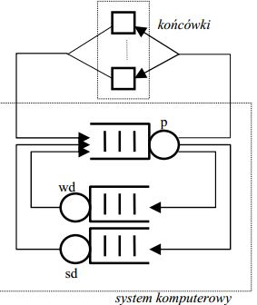
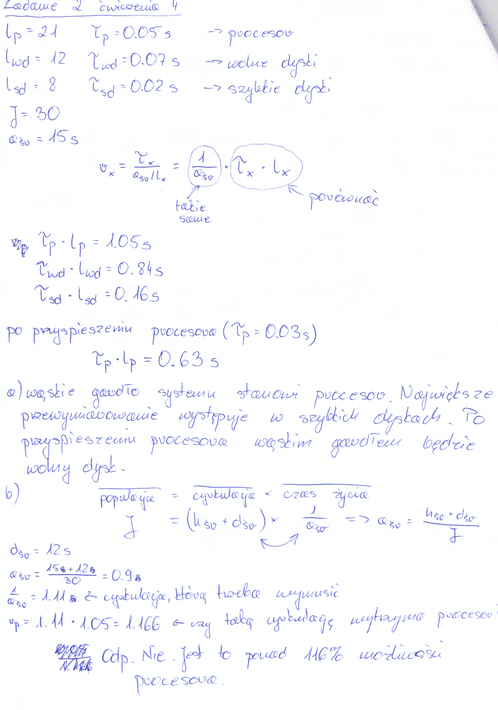

#ZADANIE 4-02

#### cechy zadania: zadanie z prawem little'a

Każda z J = 30 końcówek systemu komputerowego generuje zgłoszenia wymagające sekwencyjnego przetwarzania w procesorze, stacji wolnych dysków i stacji szybkich dysków.

Średnie liczby wizyt zgłoszenia w urządzeniach wynoszą $$ l_p = 21, l_{wd} = 12, l_{sd} = 8 $$
zaś średnie czasy przetwarzania w trakcie wizyty wynoszą $$ \tau_{p} = 0.05 s, \tau_{wd} = 0.07 s, \tau_{sd} = 0.02 s. $$
Po zakończeniu przetwarzania zgłoszenia końcówka przechodzi do fazy namysłu trwającej średnio $$ h_{sr} = 15 s $$, po czym generuje kolejne zgłoszenie.

a) Gdzie jest wąskie gardło systemu, a gdzie występuje największe przewymiarowanie? Jak się to zmieni, gdy przyśpieszymy procesor tak, że $$ \tau_p = 0.03 s $$ ?

b) Jakie przyśpieszenie procesora niezbędne jest dla uzyskania średniego opóźnienia systemowego $$ d^{*}_{sr} = 12 s $$, a jakie dla uzyskania $$ d^{*}_{sr} = 9 s $$ ?

