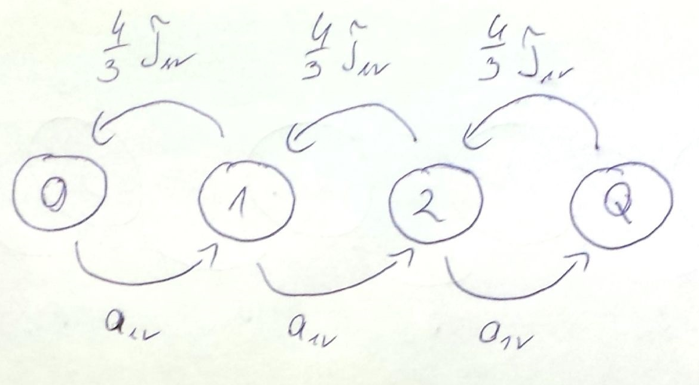
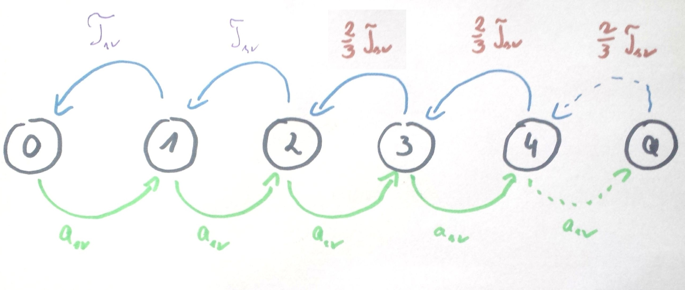
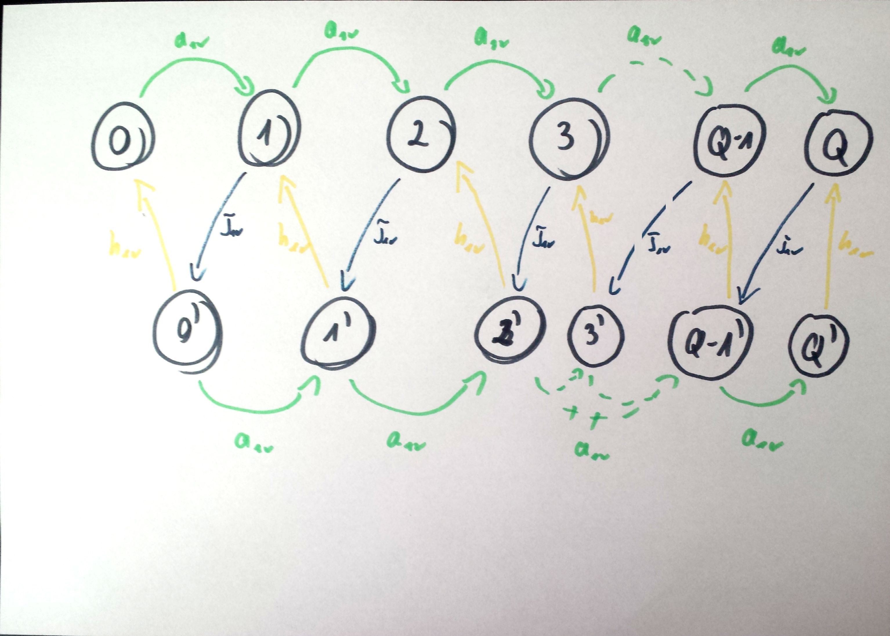
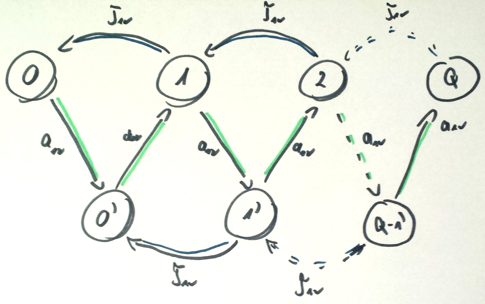

#ZADANIE 5-03

#### cechy zadania: zadanie typu graf stanów

Do systemu M/M/1 przybywa strumień zgłoszeń ze średnim interwałem $$ a_{sr} = 10 s $$ i
średnim wymaganiem zgłoszenia $$ b_{sr} = 10 j.o $$. Wydajność procesora wynosi $$ v $$
Narysuj odpowiedni graf przejść stanów dla procesu urodzin i śmierci w przypadku, gdy:

> Dla każdego z powyższych modeli starannie zdefiniuj stan systemu. Rozpatrz zdarzenia, jakie w każdej chwili mogą zajść w danym stanie oraz wynikające z nich stany w następnej chwili.

##### A) z prawdopodobieństwem $$ 25 \% $$ zgłoszenie po zakończeniu obsługi nie opuszcza systemu, lecz natychmiast powraca do kolejki,

$$ a_{sr} = 10s $$ 

zazwyczaj każde kolejne żądanie powino się pojawić co 10 s, ale co czwarte wraca do kolejki, czyli możemy przyjąć że interwał tego zgłoszenia wynosi 0 ( " bo od razu" wraca_do_kolejki/pojawia_sie_w_kolejce " )

$$ a^{(')}_{sr} = \frac{a_{sr}+a_{sr}+a_{sr}+0}{4} = \frac{3 * a_{sr}}{4} = \frac{3}{4} a_{sr}  $$

$$ \tau_{sr} = \frac{b_{sr}}{v} $$ 

> $$ r = \frac{b_{sr}}{a_{sr} * v} = \frac{\tau_{st}}{a_{sr}} \Rightarrow \tau_{st} = r * a_{sr}$$

$$ r = \frac{b_{sr}}{a^{(')}_{sr} v} = \frac{b_{sr}}{\frac{3}{4} a_{sr} v} = \frac{4}{3} \frac{b_{sr}}{a_{sr} v} = \frac{4}{3} \frac{\tau_{sr}}{a_{sr}} $$

$$ \tau_{st} = r * a_{sr} = \frac{4}{3} \frac{\tau_{sr}}{a_{sr}} a_{sr} = \frac{4}{3} \tau_{sr} $$ 

##### B) przy 3 lub więcej zgłoszeniach w systemie procesor zwiększa wydajność obsługi o $$ 50 \% $$,

$$ \tau_{sr} = \frac{b_{sr}}{v} $$

$$ \tau^{(')}_{sr} = \frac{b_{sr}}{(150 \%)v} = \frac{b_{sr}}{\frac{3}{2}v} = \frac{2}{3} * \frac{b_{sr}}{v} = \frac{2}{3} * \tau_{sr} $$

##### C) po zakończeniu okresu zajętości procesor "idzie na wakacje", w trakcie których ignoruje zgłoszenia, zaś wznawia pracę dopiero przy 3 oczekujących zgłoszeniach,

##### D) każdorazowo po zakończeniu obsługi zgłoszenia procesor "idzie na wakacje", w trakcie których ignoruje znajdujące się w systemie zgłoszenia; czas trwania "wakacji" ma rozkład wykładniczy ze średnią $$ h_{sr} $$

##### E) procesor ulega awariom, w trakcie których nie obsługuje zgłoszeń (przerwana obsługa zgłoszenia zostaje dokończona po zakończeniu awarii). Czasy trwania awarii oraz bezawaryjnej pracy mają rozkłady wykładnicze ze średnimi odpowiednio $$ f_{sr} i g_{sr} $$,

##### F) system przyjmuje zgłoszenia parami − pierwsze z pary oczekuje na następne i tak utworzona para traktowana jest jako jedno przybywające zgłoszenie o wymaganiu obsługi równym wymaganiu drugiego z pary.

