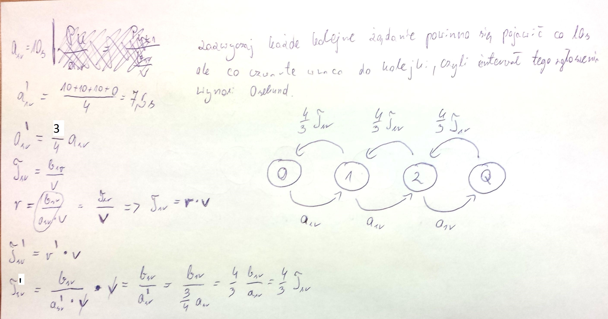
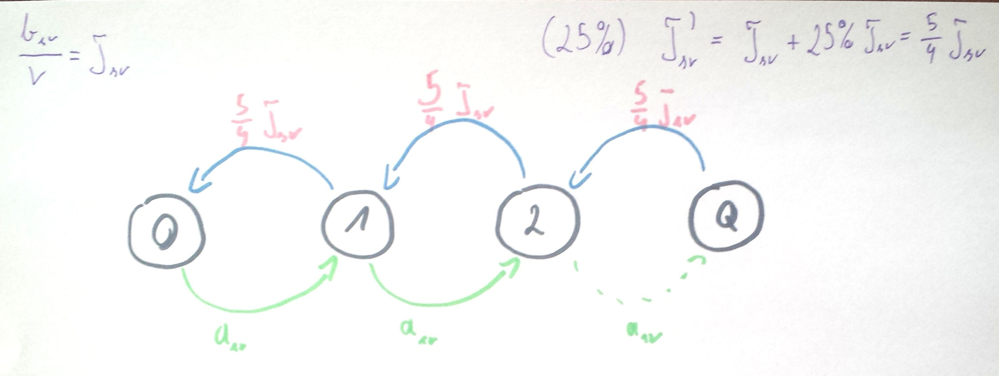
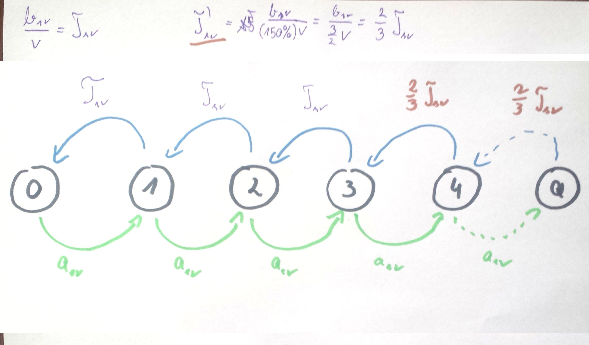
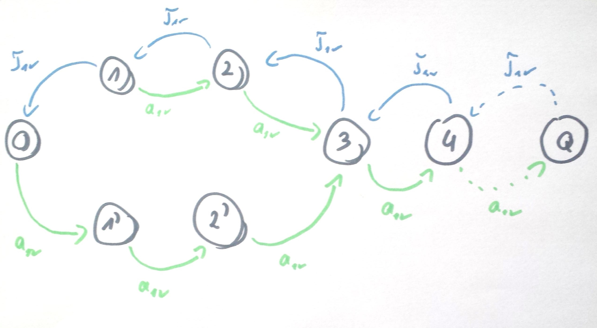
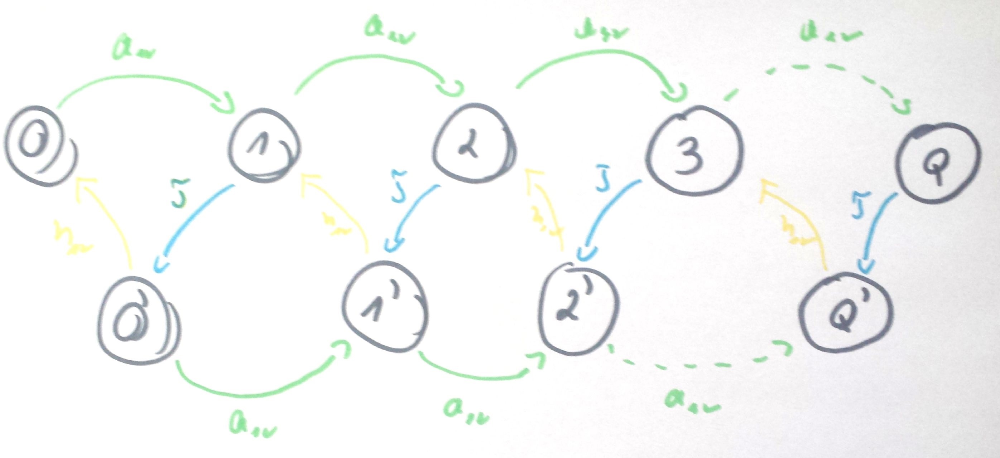
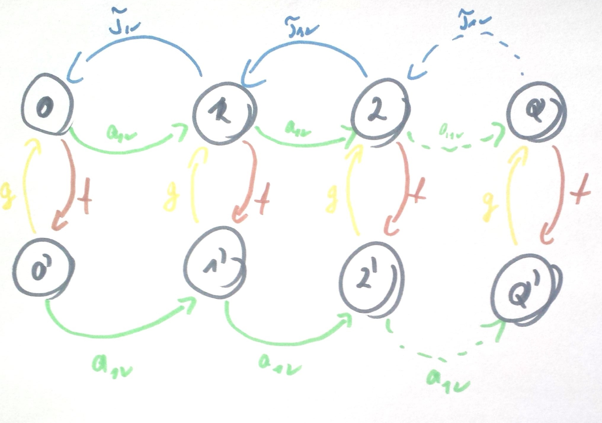

#ZADANIE 5-03

## Treść

Do systemu M/M/1 przybywa strumień zgłoszeń ze średnim interwałem $$ a_{sr} = 10 s $$ i
średnim wymaganiem zgłoszenia $$ b_{sr} = 10 j.o $$. Wydajność procesora wynosi $$ v $$
Narysuj odpowiedni graf przejść stanów dla procesu urodzin i śmierci w przypadku, gdy:

> Dla każdego z powyższych modeli starannie zdefiniuj stan systemu. Rozpatrz zdarzenia, jakie w każdej chwili mogą zajść w danym stanie oraz wynikające z nich stany w następnej chwili.

a) z prawdopodobieństwem $$ 25 \% $$ zgłoszenie po zakończeniu obsługi nie opuszcza systemu, lecz natychmiast powraca do kolejki,

b) przy 3 lub więcej zgłoszeniach w systemie procesor zwiększa wydajność obsługi o $$ 50 \% $$,

c) po zakończeniu okresu zajętości procesor "idzie na wakacje", w trakcie których ignoruje zgłoszenia, zaś wznawia pracę dopiero przy 3 oczekujących zgłoszeniach,

d) każdorazowo po zakończeniu obsługi zgłoszenia procesor "idzie na wakacje", w trakcie których ignoruje znajdujące się w systemie zgłoszenia; czas trwania "wakacji" ma rozkład wykładniczy ze średnią $$ h_{sr} $$

e) procesor ulega awariom, w trakcie których nie obsługuje zgłoszeń (przerwana obsługa zgłoszenia zostaje dokończona po zakończeniu awarii). 
Czasy trwania awarii oraz bezawaryjnej pracy mają rozkłady wykładnicze ze średnimi odpowiednio $$ f_{sr} i g_{sr} $$,

f) system przyjmuje zgłoszenia parami − pierwsze z pary oczekuje na następne i tak utworzona para traktowana jest jako jedno przybywające zgłoszenie o wymaganiu obsługi równym wymaganiu drugiego z pary.

