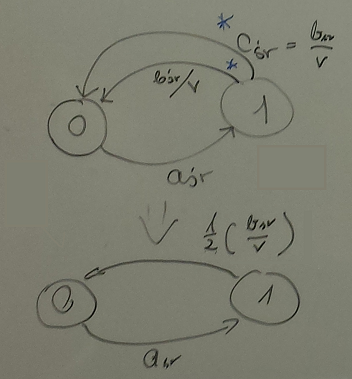

#ZADANIE 5-04

Zgłoszenia przybywają do systemu M/M/1 średnio co $$ a_{sr} = 10 s $$, średnie wymaganie wynosi $$ b_sr = 10 j.o. $$,
zaś wydajność procesora $$ v = 1 \frac{j.o}{s} $$.
W chwili przybycia każde zgłoszenie losuje swój "próg cierpliwości" z rozkładu wykładniczego o średniej $$ c_{sr} $$ 
Jeżeli po jego upływie ciągle jeszcze oczekuje na rozpoczęcie obsługi – ucieka z kolejki. 
Przyjmując $$ c_{sr} = \frac{b_{sr}}{v} $$ znajdź rozkład liczby zgłoszeń w systemie i frakcję zgłoszeń, które uciekły z kolejki.

#### Dane

> $$ a_{sr} = 10s $$

> $$ b_{sr} = 10 j.o. $$

> $$ v = 1 \frac{j.o.}{s} $$

> $$ c_{sr} = \frac{b_{sr}}{v} $$ - próg cierpliwości

> $$ Q = \infty $$

#### Rozwiązanie

równanie urodzin i śmierci : $$ \frac{p_k}{a_{sr}} = \frac{p_{k+1}}{\frac{b_{sr}}{v}} $$

$$ \frac{p_k}{a_{sr}} = \frac{p_{k+1}}{\frac{1}{2} * \frac{b_{sr}}{v}} $$

$$ p_k * \frac{b_{sr}}{2 * v} = p_{k+1} * a_{sr} $$

$$ p_{k+1} = \frac{p_k * \frac{b_{sr}}{2 * v}}{a_{sr}} $$

$$ p_{k+1} = \frac{p_k * \frac{10 j.o.}{2 * 1 \frac{j.o}{s}}}{10 s} = \frac{1}{2} * p_k $$

$$ p_{k+1} = \frac{1}{2} * p_k $$

$$ p_0 + p_1 + p_2 + ... + p_Q = 1 = \frac{p_0}{1 - 1/2}$$ - suma nieskończonego ciągu geometrycznego
  
$$ p_0 = \frac{1}{2} $$

> $$ 1 - p_0 = (1-L)* r \Rightarrow L = 1 - \frac{1-p_0}{r} $$ - równanie ciągłości przepływu
 
$$ r = \frac{b_{sr}}{a_{sr} * v} = \frac{10}{10 * 1} = 1 $$

$$ L = 1 - \frac{1 - 0.5}{1} = 1 - 0.5 = 0.5$$

----
**Odpowiedź:** frakcja zgłoszeń wynosi $$ 50 \% $$